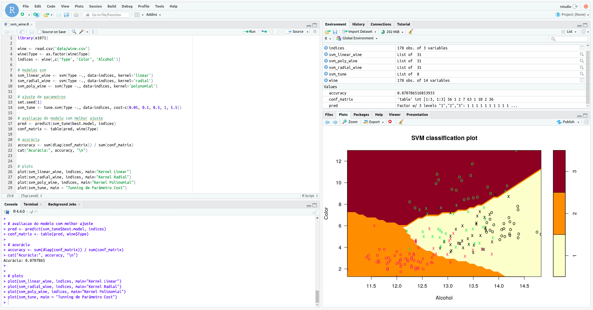

# Support Vector Machine

> O Support Vector Machine (SVM) é um algoritmo de aprendizado de máquina usado para classificação e regressão. Ele encontra um hiperplano que separa dados pertencentes a duas classes diferentes. Basicamente, o SVM identifica os pontos extremos entre as classes e usa esses pontos para definir as margens de separação. Além disso, o SVM não se limita a dados linearmente separáveis; ele pode ser aplicado a dados mais complexos também.

Este repositório apresenta a aplicação desse algoritmo em diferentes datasets utilizando a linguagem R com RStudio. Atualmente, ele inclui scripts para os datasets Iris e Wine.



## Requisitos

- R e RStudio instalados (para execução local)
- Docker instalado (para execução via Docker)

## Como executar os scripts

Você pode executar o código de duas maneiras: localmente ou utilizando Docker.

### Execução local

1. Clone o repositório e navegue até a pasta do projeto.
    ```sh
    git clone https://github.com/esscova/svm-R.git
    cd svm
    ```

2. Execute o script R localizado em `scripts/`.

### Utilizando Docker

1. Clone o repositório e navegue até a pasta do projeto.
    ```sh
    git clone https://github.com/esscova/svm-R.git
    cd svm
    ```

2. Para construir a imagem Docker, execute:
    ```sh
    docker build -t svm-R .
    ```

3. Para iniciar o container Docker, execute:
    ```sh
    docker run -p 8787:8787 svm-R
    ```

4. Acesse o RStudio Server em `http://localhost:8787`.

5. Faça login utilizando as seguintes credenciais:
    - **Usuário**: `rstudio`
    - **Senha**: `123456`

6. Abra o arquivo `svm_wine.R` no RStudio e execute o código.

### Notas adicionais

- Certifique-se de ter o Docker instalado na sua máquina.
- A imagem Docker é baseada em `rocker/rstudio:latest` e inclui os pacotes R necessários.
- O arquivo `wine.csv` será copiado para o container Docker e estará disponível para o script R durante a execução.

## Relatórios das análises
Para uma análise detalhada do processo de implementação da SVM e dos resultados, consulte:

- <a href='/reports/iris_reports.md'>Classificação das espécies de flores do dataset Iris</a>
- <a href='/reports/wine_reports.md'>Classificação dos tipos de vinhos do dataset Wine</a>

## Connect with me

[](mailto:wmoreira.ds@gmail.com)
[](https://www.linkedin.com/in/wellington-moreira-santos/)
[](https://www.facebook.com/wellmoreiras)
[](https://www.instagram.com/moreira.883/)
[](https://t.me/wellington_moreira_santos)
